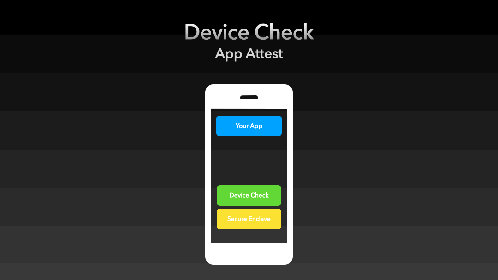

+++
date = '2025-02-24T16:45:23+01:00'
draft = true
title = 'App Attestation'
+++

## App Attestation

App Attestation is a service of the  [DeviceCheck framework](https://developer.apple.com/documentation/devicecheck) and, to quote the documentation, is used to *ensure that the requests your server receives come from legitimate instances of your application*.

### Why bother?
Today, it is easier than ever to intercept an application's traffic. Even on device without any sophisticated setup. You can download [Proxyman](https://apps.apple.com/de/app/proxyman-network-debug-tool/id1551292695) from the AppStore and read the HTTPS traffic of all apps that don't implement any protection like certificate pinning or other measures.

<!--more-->

Once you see the requests being made, you can also access header information such as access keys or api tokens.

At the same time to access beeing tivial, the value of those tokens has never been higher. More and more applications use services from cloud providers like Google, Firebase, etc. Especially since the introduction of GPT services to provide access to generative models, these paid services have been heavily integrated. If you hijack an access token and use it outside of your application, someone can make your cloud service bill explode.

### How does it improve security?
App Attestation does not protect your app's communications from being intercepted. But it does protect your service from being misused by other parties. In technical terms, it protects you from so-called replay attacks.

Even if an attacker gains access to an access token and attestation payload, he cannot use it. Imagine that your requests can only be sent once.

### How does it work?
Before we get to the implementation, let's take a look at the big picture and the players involved.


* Your Service - in my examples this will be a Vapor Backend providing rest services, but it can be any other framework of your choice.
* App Attest Service - in the implementation part you will see, that this presents itself as a local framework. But in fact it is making remote calls to Apple.
* Your App - nothing fancy here. Usual iOS App making HTTP requests.

#### Step 1: Generate a KeyPair

The first step is to generate a private and public key that will be used in the attestation process. Fortunately, the DeviceCheck framework does this for us. It interacts with the secure enclave and returns a *key identifier*, which is just a reference to the generated key.

We store this KeyId for later use. You can use any storage you prefer. In this example it will be the keychain.

```swift
guard DCAppAttestService.shared.isSupported else {
	// Fail gracefully
	return
}

let keyId = try await DCAppAttestService.shared.generateKey()

keychain.attestationKeyId = keyId
```
One thing needs to be noted here: In line 1, we make sure that our device supports App Attestation. While every current iOS device supports attestation, not every target, i.e. extensions, do.

#### Step 2: Fetch a Challenge

Before talking to the App Attest service, we first need to get a challenge from our backend service. A hash of this challenge will be included in the resulting attestation object. This process helps us prevent replay attacks.

I will skip showing you how to send a simple HTTP request to fetch the challenge, and instead show you how to implement the challenge generation on the Vapor side:

```swift
import Crypto

let challenge = Data(AES.GCM.Nonce())

var challenges: [UUID: Data] = [:]

let challengeID = UUID()
challengeStorage[challengeID] = challenge
```
Using the Cryptop framework, we create a nonce. Some truly random bytes. We also generate a UUID to identify and store the challenge.
Since it is included in the attestation object, we need to keep it around for later validation purposes.

To keep things simple, in this example I will use an in-memory storage using a dictionary.

#### Step 3: Create the Attestation


With all the preparations out of the way, we can finally proceed to create an Attestation for our KeyPair.

```swift
let keyId = keychain.attestationKeyId

let challenge = await fetchChallenge()
let hash = Data(SHA256.hash(data: challenge))
        
let attestKey = try await DCAppAttestService.shared.attestKey(keyId, clientDataHash: hash)
```

Using our key identifier and a hash of the retrieved challenge, we call the *DCAppAttestService* to create our attestation.

#### Step 4: Validating the Attestation


The next step, and depending on your use case, this may be the last step, is to present the Attestation object to your server.

There is nothing special to do on the app side. We send the attestation object to our service using a regular POST request. In addition to the attestation object, we include the challenge we retrieved earlier and our key identifier in the request.

Validation, on the other hand, is something else. Fortunately, [Apple documents the necessary steps in great detail](https://developer.apple.com/documentation/devicecheck/validating-apps-that-connect-to-your-server).

```swift
import AppAttest

let attestation: Data = ...
let keyID: Data = ...
let challengeID: UUID = ...

let challenge = challenges[challengeID]

let request = AttestationRequest(attestation: attestation, keyID: keyID)
let appID = AppID(teamID: "83Z139DVZ2", bundleID: "com.example.myapp")

let result = try AppAttest.verifyAttestation(challenge: challenge, request: request, appID: appID)

``` 


