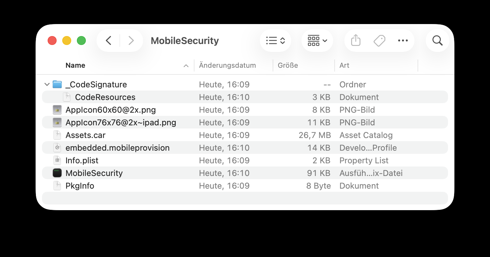
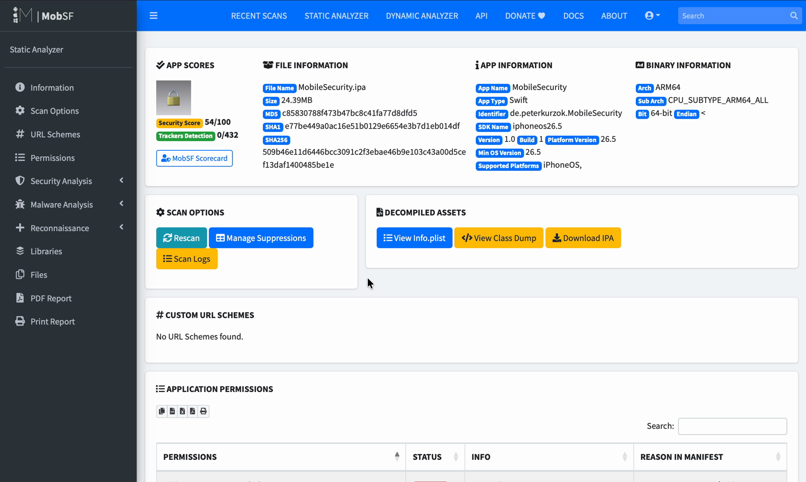
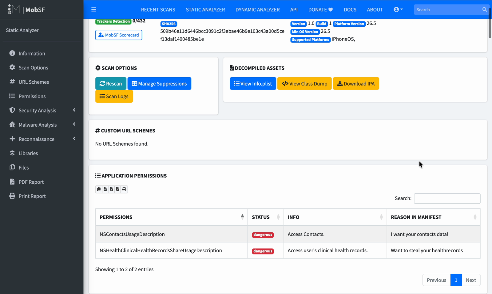
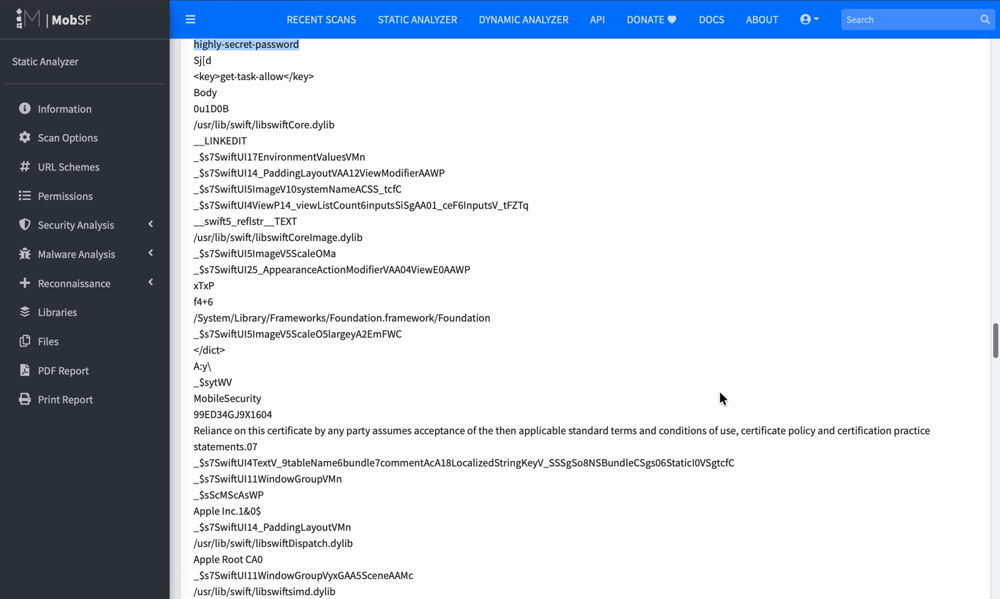
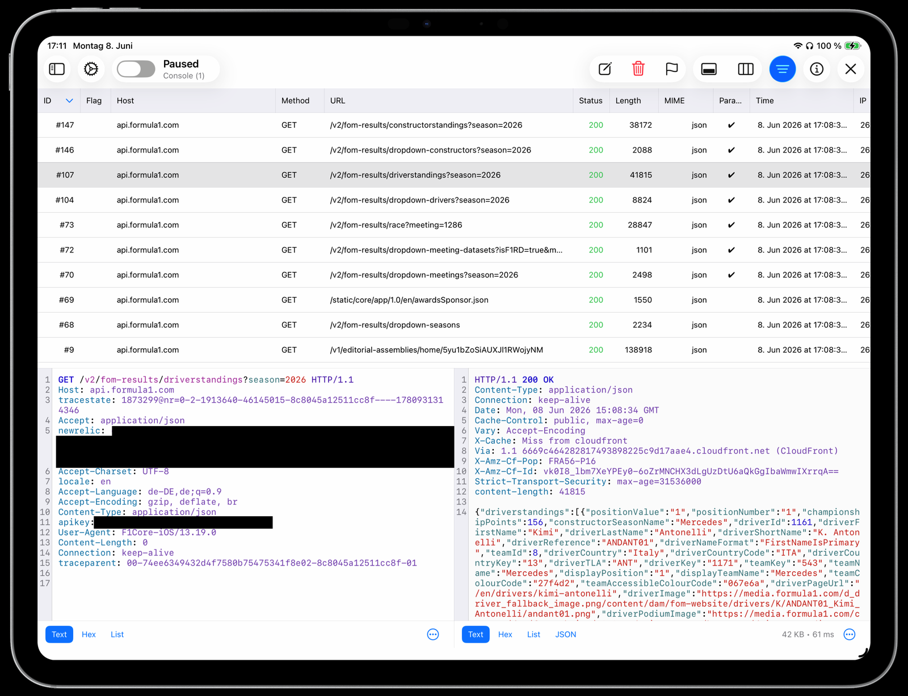
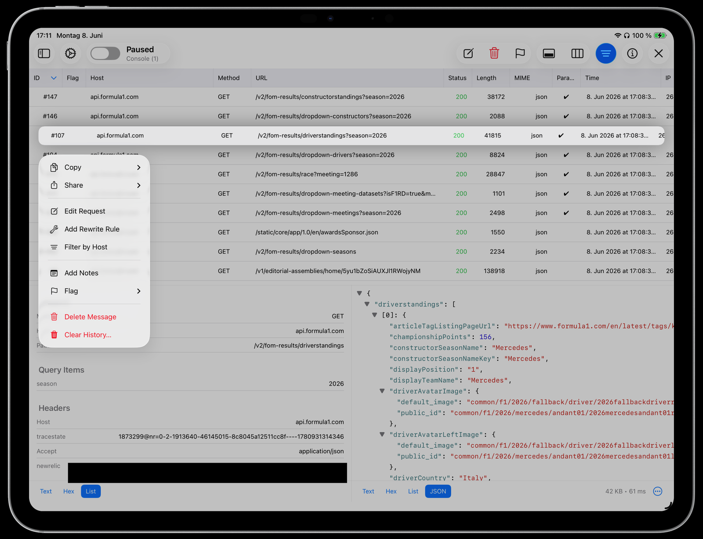
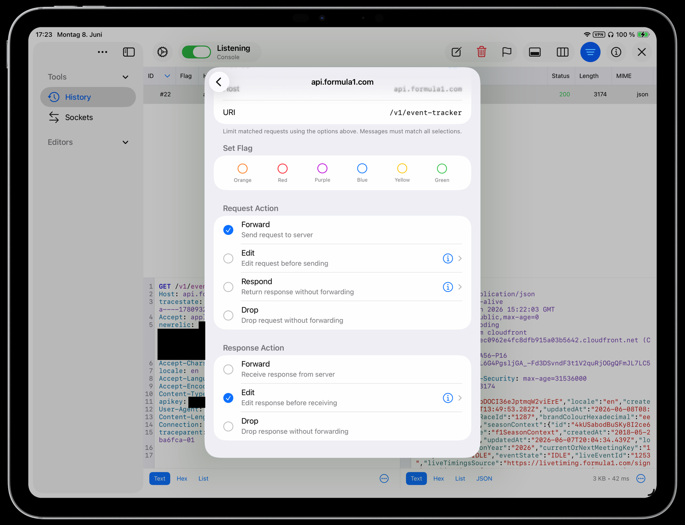
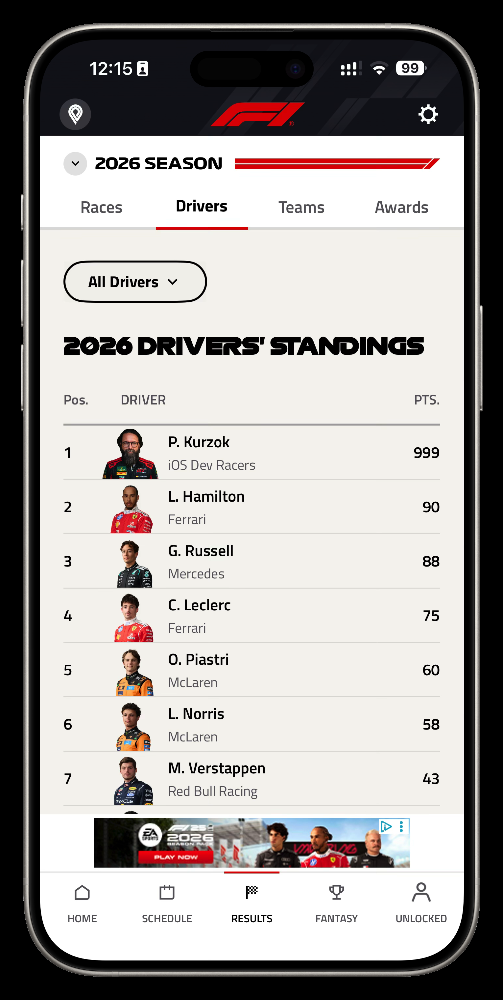
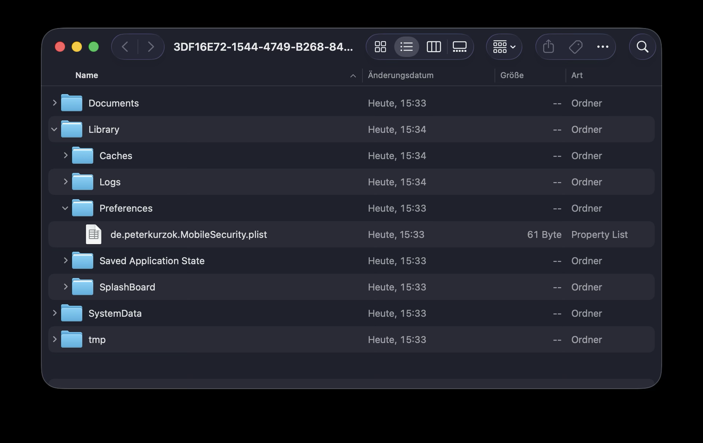
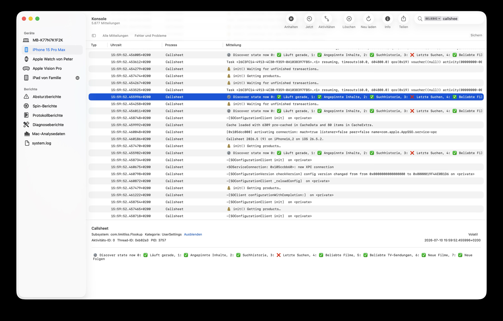

+++
date = '2026-09-14T21:15:00+02:00'
draft = false
title = 'Mobile Security Fundamentals: Build Apps That Fight Back'
tags = ['ios', 'security', 'swift', 'keychain', 'networking']
+++

## Mobile Security Fundamentals: Build Apps That Fight Back

This is the written version of the talk I gave at [iOSDevUK 2026](https://www.iosdevuk.com). The slides are on [Speaker Deck](https://speakerdeck.com/pkurzok/mobile-security-fundamentals-build-apps-that-fight-back), but you don't need them: everything is in here, including a few slides I had to skip on stage for time. Four chapters, each one starting with the attack and ending with the defence, and all of it things you can do to an existing app this week.

<!--more-->

## Why should you care?

Think about what a user hands over when they install your app. Email. Home address. Payment details. Health data.

They trust that we did our homework.

And most of us got into iOS because we love building great experiences, not because we're security experts. But our users don't know the difference. To them, we're the last thing standing between their data and the bad guys.

So let's make sure that trust is justified. This post has four chapters:

1. **Tooling**: the attacker's actual toolkit
2. **Secure Storage**: where your data lives
3. **Secure Authentication**: proving who your user is
4. **Secure Communication**: making sure nobody's listening

Every chapter: first the attack, then the defence.

## Chapter 1: Tooling — know your enemy's toolkit

Attacker hat on.

This is the fun part. These are the same tools researchers and attackers use to pull an iOS app apart. I start here because you can't defend against something you don't understand.

And everything in this chapter, you can do to your own app this afternoon.

### An IPA is just a zip

What can an attacker learn without even running your app? Quite a lot.

An IPA is just a zip. Rename it to `.zip`, unzip it, and start browsing: bundle structure, frameworks, `Info.plist`, entitlements. Here's an entitlements dict declaring HealthKit. Your app's whole identity, right there to read:

```xml
<dict>
	<key>com.apple.developer.healthkit</key>
	<true/>
</dict>
```



One caveat: App Store and TestFlight binaries are FairPlay-encrypted, so strings in the main binary need a decrypted dump first. But everything around it (plists, entitlements, bundled JSON, assets) is readable right now. And local or enterprise builds aren't encrypted at all.

So the rule holds: never ship secrets in the bundle. No API keys, no "temporary" passwords, no legacy endpoints you'd rather nobody knew about.

### MobSF: a security audit in a box

Doing that by hand gets tedious fast. That's where [MobSF](https://github.com/MobSF/Mobile-Security-Framework-MobSF), the Mobile Security Framework, comes in. It's free, open source, and one command away:

```bash
# Using Docker
docker pull opensecurity/mobile-security-framework-mobsf:latest
docker run -it --rm -p 8000:8000 opensecurity/mobile-security-framework-mobsf

# Using Container
container run --rm -p 127.0.0.1:8000:8000 docker.io/opensecurity/mobile-security-framework-mobsf:latest
```

Open `localhost:8000`, drag in an IPA, wait about a minute, and you get a full report: hardcoded secrets, permissions, insecure API usage.

The overall security score sits at the top.



*The first time you see your own app's score, it's humbling.*

Below that are the findings by category and severity, and the permissions and entitlements you claim. Click any finding to see what it is and where it lives.



It also dumps every string it can find in the binary.



*This demo app ships a hardcoded password on purpose. Yours might not be on purpose.*

If you've never run MobSF against your own app, do it. You may be surprised.

### Debugging proxies

That was static analysis. Now let's run the app.

Debugging proxies like [Proxyman](https://proxyman.com), [Proxygen](https://proxygen.app), [Charles](https://www.charlesproxy.com) or mitmproxy sit between your app and the internet and read every call. Setting one up takes four steps and about two minutes: install it on your Mac, point the phone's WiFi at it, trust the certificate, done.

From then on, every request, every header, every token and every body is in plaintext. And most apps do nothing to stop it.

Here is Proxygen running against a real app: the official Formula 1 app. In the screenshot below, the top half is the request list, every call the app makes, grouped by host. Underneath, the request side on the left shows the headers, auth, everything the app sends, and the response side on the right shows the full body coming back.



Look at the request headers and there it is: `apikey`, in plaintext. An app with millions of users sends an API key in a plain header and does nothing to stop me from reading it. I've blacked out the key and a monitoring token in the screenshot, but on my iPad they were right there.

This isn't about pointing fingers at the F1 app. It's an observation about how normal this is, even for big, well-funded apps.

### You don't just read the traffic, you change it

It gets better. Right-click any request and choose Add Rewrite Rule.



Pick the endpoint, then choose what happens: forward, edit, respond or drop. On the request, or on the response. For the demo I set the response action to Edit, so I get to change the body before the app ever receives it.



A few edited numbers later:



*And now I'm leading the 2026 Drivers' Championship with 999 points.*

Funny, but that's the real point: if the client believes whatever the network hands it, the client will believe anything.

### Use these tools on your own app

So here's the mindset from this chapter: these aren't hacker tools. They're developer tools.

MobSF belongs in your release checklist. A proxy belongs on your debug builds. Point it at your own traffic and ask three questions:

- Does every call use HTTPS?
- Are tokens in headers, not URLs?
- Is anything sensitive sitting in a request body?

If you don't test your own app this way, someone else will.

Now, what about the data sitting on the device?

## Chapter 2: Secure Storage

Every app stores something: tokens, preferences, cached responses, documents. The question is never "do you store data?". It's "where, and is it protected?"

### The app sandbox

A quick shared baseline first; most of this you'll know.

Every app lives in its own sandbox. That's iOS's first line of defence: apps can't read each other's files. But inside your own sandbox, protection is entirely on you.

Here's what a container looks like, and what happens to each folder when the device is backed up:

```text
<container>/
├── Documents/              backed up ✅  synced to iCloud ☁️
├── Library/
│   ├── Caches/             not backed up 🚫  purgeable
│   ├── Logs/
│   └── Preferences/
│       └── <bundle-id>.plist   ← UserDefaults lives here; backed up ✅  synced ☁️
└── tmp/                    not backed up 🚫  purgeable
```

And this is a real one from the Simulator:



*Tip: with [RocketSim](https://www.rocketsim.app) it's Sandbox User Data, five seconds, and you're in.*

Documents is backed up and synced. Caches and tmp are not backed up and can be purged by the system. And the UserDefaults plist in Preferences? Backed up. Synced. Remember that plist file.

### When the sandbox is compromised

The sandbox also isn't always there.

On a jailbroken device the restrictions are gone, and any script reads any app's files. And jailbreaking isn't just teenagers; researchers and attackers do it routinely.

An iTunes or iCloud backup pulls your whole sandbox onto a Mac, browsable with normal file tools. MDM and enterprise tools can reach managed device data. And with physical access, forensic tools like Cellebrite take everything.

So: protect the data as if the sandbox weren't there. (With Advanced Data Protection turned on, iCloud backups are at least end-to-end encrypted.)

### UserDefaults is just a plist file

The number one mistake I see in real codebases: the auth token in UserDefaults.

```swift
import Foundation

let authToken = "eyJhbGciOiJIUzI1NiJ9.definitely-not-secret"

// This is NOT secure storage
UserDefaults.standard.set(authToken, forKey: "auth_token")
```

And I get it. One line, lovely API.

But underneath, UserDefaults writes an unencrypted plist into your Preferences folder. It's in every backup, and it's readable on a jailbroken device.

The rule: UserDefaults is for preferences, like whether onboarding is finished or which theme the user picked. Never for tokens, passwords or secrets.

### Keychain Services

This is where secrets actually belong: [Keychain Services](https://developer.apple.com/documentation/security/keychain-services).

The Keychain is the right place for passwords, auth tokens and session credentials, cryptographic keys, and any other small secret. Items are encrypted with the device's hardware key, which makes them dramatically harder to reach than the file system, even on a jailbroken device. And Keychain items survive a reinstall, which is usually exactly what you want for a session credential. If you want to go deep, the [detailed Keychain guidance](https://developer.apple.com/forums/thread/724013) on the Apple Developer Forums is the place to go.

The whole thing is one dictionary and one call, plus the error handling:

```swift
import Foundation
import Security

enum KeychainError: Error {
    case encodingFailed
    case unhandled(OSStatus)
}

func storeToken(_ token: String, service: String, account: String) throws {
    guard let data = token.data(using: .utf8) else { throw KeychainError.encodingFailed }

    let query: [CFString: Any] = [
        kSecClass:          kSecClassGenericPassword,
        kSecAttrService:    service,
        kSecAttrAccount:    account,
        kSecAttrAccessible: kSecAttrAccessibleWhenUnlockedThisDeviceOnly,
        kSecValueData:      data
    ]

    let status = SecItemAdd(query as CFDictionary, nil)

    if status == errSecDuplicateItem {
        let search: [CFString: Any] = [
            kSecClass:       kSecClassGenericPassword,
            kSecAttrService: service,
            kSecAttrAccount: account
        ]
        let update: [CFString: Any] = [kSecValueData: data]
        let updateStatus = SecItemUpdate(search as CFDictionary, update as CFDictionary)
        guard updateStatus == errSecSuccess else { throw KeychainError.unhandled(updateStatus) }
    } else if status != errSecSuccess {
        throw KeychainError.unhandled(status)
    }
}
```

Let me walk through it:

- **Service plus account** identify the item. You need both; that pair is the unique key.
- **The Keychain stores `Data`**, so encode first.
- **`kSecClassGenericPassword`** is the right class for a token.
- **`kSecAttrAccessible`** is the line that actually matters for security. `WhenUnlockedThisDeviceOnly` means the item is readable only while the device is unlocked, and it never leaves this device, so it's never in a backup. More on the other levels below.
- **`SecItemAdd`** writes it. If the item already exists you get `errSecDuplicateItem`. Handle that with `SecItemUpdate`, as above, rather than delete-then-add.

And in a real app, wrap this. Don't sprinkle `SecItem` calls across your codebase. If you'd rather not write the wrapper yourself, [KeychainAccess](https://github.com/kishikawakatsumi/keychainaccess) and [Valet](https://github.com/square/Valet) are well-established options.

### Keychain accessibility levels

| `kSecAttrAccessible…` | Readable | In backups |
|---|---|---|
| `WhenUnlocked` | while unlocked | yes |
| `AfterFirstUnlock` | after first unlock since boot | yes |
| `WhenUnlockedThisDeviceOnly` | while unlocked | no |
| `AfterFirstUnlockThisDeviceOnly` | after first unlock since boot | no |
| `WhenPasscodeSetThisDeviceOnly` | while unlocked, only if a passcode is set | no |

The top two end up in backups. The `ThisDeviceOnly` variants don't.

For auth tokens, use `WhenUnlockedThisDeviceOnly`. Then they're never in any backup, and they can't be restored onto someone else's device and replayed.

### Biometric gating for Keychain items

You can go one step further.

```swift
import Foundation
import Security

func storeBiometricGated(_ data: Data, service: String, account: String) -> OSStatus {
    guard let access = SecAccessControlCreateWithFlags(
        nil,
        kSecAttrAccessibleWhenUnlockedThisDeviceOnly,
        .biometryCurrentSet, // Face ID / Touch ID required
        nil
    ) else { return errSecParam }

    let query: [CFString: Any] = [
        kSecClass:             kSecClassGenericPassword,
        kSecAttrService:       service,
        kSecAttrAccount:       account,
        kSecAttrAccessControl: access,
        kSecValueData:         data
    ]

    return SecItemAdd(query as CFDictionary, nil)
}
```

With `SecAccessControl`, the system won't release the item until Face ID or Touch ID succeeds. The OS runs the whole prompt. Your code never touches biometric data; you just get the item, or you don't.

That makes it a good gate: before a payment, before an email change, before account deletion.

`biometryCurrentSet` also invalidates the item if a face or fingerprint is added or removed. Nice bonus.

Keep this one in mind. In chapter three we'll see why this is the version an attacker can't hook.

### File-level encryption (Data Protection)

For the bigger things (documents, databases, media) there's Data Protection.

Good news first: your files are already encrypted at rest. `UntilFirstUserAuthentication` has been the default for third-party apps since iOS 7. But that means they're readable any time after the first unlock, until the next reboot.

The upgrade is `.completeFileProtection`: readable only while the device is unlocked.

```swift
import Foundation

func save(_ data: Data, to fileURL: URL) throws {
    // Writing a file with complete protection
    try data.write(to: fileURL, options: .completeFileProtection)
}
```

| Option | Readable when |
|---|---|
| `.completeFileProtectionUntilFirstUserAuthentication` | Any time after the user has unlocked the device once since boot, including while locked afterwards |
| `.completeFileProtectionUnlessOpen` | Only openable while unlocked, but stays accessible if the handle was already open when the device locked. New files can also be created while locked (write-only) |
| `.completeFileProtection` | Only while the device is unlocked (key is evicted ~10 s after lock) |

The catch: if you need to touch the data while the device is locked, say in a background push handler, you have to stay on `UntilFirstUserAuthentication`.

### Where should I store X?

So here's a decision tree you can actually use:

```text
Is it a secret? ──yes──▶ Keychain (.whenUnlockedThisDeviceOnly, + biometric gate if it matters)
      │ no
Large or structured? ──yes──▶ File system / database (.completeFileProtection)
      │ no
Just a user preference? ──yes──▶ UserDefaults
      │ no
Reconsider whether you should be storing it at all
```

That's storage. Next: proving who the user is.

## Chapter 3: Secure Authentication

How does your app know the person using it is who they claim to be?

Before the attacks and defences, let's look at how auth actually works, because the model you pick decides your whole security posture.

### Classic auth: username + password

The basic model: a login screen, email and password, off to your server, and a token comes back.

```text
📱 App ──── username + password ────▶ 🖥️ Your server
📱 App ◀─── session / token ────────── 🖥️ Your server
```

Simple, and completely fine when you own the whole stack.

It breaks the moment you want "log in with Google". The user would type their Google password into your app, and your app and your server would both see credentials they should never touch.

So how do we fix that?

### OAuth2 + PKCE: delegated authentication

OAuth flips it around. You don't collect the password. You redirect the user to the identity provider. They log in there, they consent, and the provider hands an authorization code back. Then your server exchanges that code for tokens.

```text
📱 App ── redirect ──▶ 🔐 Identity provider (Google, Apple, GitHub …)
                        👤 user logs in there and consents
📱 App ◀── authorization code ── 🔐 Identity provider
📱 App ── code + code_verifier ──▶ 🖥️ Your server ── exchange ──▶ 🔐 Identity provider
📱 App ◀── access + refresh token ── 🖥️ Your server
```

Your app never sees the password, and the token it ends up with is scoped and revocable.

And this is the part to get right: PKCE. When you start the flow, you send a `code_challenge`, the SHA-256 of a random verifier. On the exchange leg you present the verifier itself. That binds the code to the client that asked for it.

Why it matters: it protects the one leg your server exchange can't, a malicious app on the device hijacking the redirect and stealing the code. Without PKCE that stolen code is enough. With it, it's useless.

[RFC 9700](https://www.rfc-editor.org/rfc/rfc9700), the OAuth 2.0 Security Best Current Practice, makes PKCE mandatory for public clients. And every mobile app is a public client.

### How tokens get stolen

So how do tokens actually get stolen? See how many of these look familiar:

- **A token in UserDefaults** ends up in every backup, and can be read straight out of it.
- **A `print(authToken)` somebody left in.** Other apps can't read your logs; that ended with unified logging in iOS 10. But anyone who plugs the phone into a Mac sees it in Console.app or `log stream`, and it's persisted in the sysdiagnose archives users send to support. Worth knowing: `Logger` redacts dynamic values by default. Plain `print()` doesn't.
- **Long-lived tokens** turn one theft into months of access.
- **Tokens in URL query parameters** end up in your server access logs.
- **Keychain items without `ThisDeviceOnly`** can be pulled out of an encrypted backup.



Once you know the list, every one of these is an easy fix.

### Short-lived tokens + refresh rotation

If you take one thing from this chapter back to your team, take this one:

```text
Access token:  expires in 15 minutes
Refresh token: expires in 30 days, single-use
               rotated on every use
```

Short-lived access tokens mean a stolen one is useless after 15 minutes.

Refresh tokens are single-use and rotated on every use. If an attacker uses a stolen refresh token and your real app uses the same one too, the server sees the reuse and kills the entire token family. That's what RFC 9700 asks for.

If your app has tokens that never expire (and plenty do), this is a very manageable change that massively cuts the blast radius.

### Biometry for sensitive operations

Here's the pattern for requiring biometry before a sensitive action:

```swift
import LocalAuthentication

enum AuthError: Error {
    case biometryUnavailable
}

func requireBiometry(reason: String) async throws {
    let context = LAContext()
    var error: NSError?

    guard context.canEvaluatePolicy(
        .deviceOwnerAuthenticationWithBiometrics,
        error: &error
    ) else { throw AuthError.biometryUnavailable }

    try await context.evaluatePolicy(
        .deviceOwnerAuthenticationWithBiometrics,
        localizedReason: reason
    )
}

// Usage
try await requireBiometry(reason: "Confirm this payment")
```

`canEvaluatePolicy` checks support, `evaluatePolicy` runs the prompt.

Use it as a gate: payment, email change, account deletion. A second factor, never a replacement for server-side auth.

But be aware: `evaluatePolicy` on its own just returns a Bool, and on a jailbroken device that Bool can be patched out with Frida. The version that can't be patched is the Keychain plus `SecAccessControl` from chapter two. There, the Secure Enclave only releases the item on a real match.

And prefer `.deviceOwnerAuthentication` over `.deviceOwnerAuthenticationWithBiometrics`, so a biometry lockout falls back to the passcode instead of dead-ending your user.

### Don't roll your own auth

This is my "please don't" section. Don't build auth from scratch. Every custom line is a line that can have a bug, and auth bugs are expensive. Use the flows the platform gives you:

- **Sign in with Apple** is backed by the user's Apple Account with two-factor authentication and authorised with Face ID or Touch ID. No password ever reaches your app, and users get a private email relay on top.
- **[ASWebAuthenticationSession](https://developer.apple.com/documentation/authenticationservices/aswebauthenticationsession)** is Apple's implementation of the OAuth flow above, in a secure browser session.
- **Passkeys** via `ASAuthorizationController` are phishing-resistant.

These are audited by Apple and handle edge cases you haven't thought of.

One detail for `ASWebAuthenticationSession`: since iOS 17.4, use `.https(host:path:)` for the callback. Any app can claim a custom URL scheme, and there are real code-stealing attacks that do exactly that. An HTTPS callback is tied to a domain you prove you own through Associated Domains.

```swift
import AuthenticationServices
import UIKit

final class LoginCoordinator: NSObject, ASWebAuthenticationPresentationContextProviding {
    private var session: ASWebAuthenticationSession?

    func start(authURL: URL) {
        let session = ASWebAuthenticationSession(
            url: authURL,
            callback: .https(host: "yourapp.com", path: "/oauth/callback")
        ) { callbackURL, error in
            // Handle callback, extract the authorization code
        }
        session.presentationContextProvider = self
        session.prefersEphemeralWebBrowserSession = true
        self.session = session
        session.start()
    }

    func presentationAnchor(for session: ASWebAuthenticationSession) -> ASPresentationAnchor {
        ASPresentationAnchor()
    }
}
```

### Auth checklist

A quick checklist to score your current app:

- [ ] Auth tokens stored in the Keychain
- [ ] Access tokens expire in under an hour
- [ ] Refresh tokens are single-use and rotated
- [ ] PKCE on every mobile OAuth flow
- [ ] No tokens in URL query parameters
- [ ] No auth logging in release builds
- [ ] Biometry gate before sensitive operations
- [ ] Platform auth (Sign in with Apple, Passkeys, `ASWebAuthenticationSession`) instead of your own

Eight out of eight and you're in good shape. Otherwise you've just got a prioritised to-do list.

On to the last chapter. It's my favourite.

## Chapter 4: Secure Communication

If you remember one chapter, make it this one. This is where the most dramatic attacks happen, and where a surprising number of big, well-known apps are still completely unprotected.

### TLS is necessary, but not sufficient

What TLS gives you: an encrypted connection, server authentication through the certificate chain, and integrity, so content can't be tampered with in transit.

And App Transport Security is your on-by-default floor: TLS 1.2 or higher with forward secrecy. The one thing not to do is ship `NSAllowsArbitraryLoads` to switch it off.

What TLS does not protect against: an attacker who controls a trusted certificate authority. An MDM profile installing a corporate root. Or a user who deliberately installs a proxy certificate, which is exactly what I did in chapter one.

HTTPS means safe from someone listening. Not safe from someone in the middle.

### Man-in-the-middle

Your app thinks it's talking to your server. But there's a proxy in between. It terminates your TLS, reads everything, then opens a fresh connection to the real server.

```text
What your app thinks is happening:
📱 App ════ 🔒 https ════▶ 🖥️ Server

What is actually happening:
📱 App ════ 🔒 https ════▶ 👿 Attacker proxy ════ 🔒 https ════▶ 🖥️ Server
                            reads everything: auth tokens, requests, responses, user data
```

Your app has no idea. The attacker's certificate is trusted by the device, so as far as `URLSession` is concerned the handshake was perfectly valid, and the app happily sends everything. That's exactly what the Proxygen screenshot in chapter one shows.

Sounds like Hollywood. But on shared WiFi (a conference, a coffee shop, an office) it's genuinely easy. All it takes:

1. Be on the same network (or control DNS)
2. Get one certificate trusted on the device

### Certificate pinning

The idea behind certificate pinning: stop trusting the whole CA system, and trust your own key instead.

Your app ships a known-good public key hash. On every connection you check the server's key against it. No match: refuse the connection.

```text
📱 App ════ 🔒 https ════▶ 👿 Attacker proxy   ❌ certificate mismatch, connection refused
```

And now the attacker's proxy fails. Their certificate is trusted by the device, but it isn't yours.

### Pinning in URLSession

Here's the implementation, including the helper that tends to be left out:

```swift
import CryptoKit
import Foundation
import Security

final class PinningDelegate: NSObject, URLSessionDelegate {

    // Base64 SHA-256 of your server's SubjectPublicKeyInfo, e.g. from:
    // openssl s_client -connect api.yourapp.com:443 </dev/null 2>/dev/null \
    //   | openssl x509 -pubkey -noout | openssl pkey -pubin -outform der \
    //   | openssl dgst -sha256 -binary | base64
    private let pinnedHash = "r/mIkG3eEpVdm+u/ko/cwxzOMo1bk4TyHIlByibiA5E="

    func urlSession(
        _ session: URLSession,
        didReceive challenge: URLAuthenticationChallenge,
        completionHandler: @escaping (URLSession.AuthChallengeDisposition, URLCredential?) -> Void
    ) {
        guard
            challenge.protectionSpace.authenticationMethod == NSURLAuthenticationMethodServerTrust,
            let trust = challenge.protectionSpace.serverTrust
        else { return completionHandler(.cancelAuthenticationChallenge, nil) }

        // 1. Validate the chain FIRST (MASTG-BEST-0073)
        guard SecTrustEvaluateWithError(trust, nil) else {
            return completionHandler(.cancelAuthenticationChallenge, nil)
        }

        // 2. THEN compare the pin
        guard
            let chain = SecTrustCopyCertificateChain(trust) as? [SecCertificate],
            let leaf = chain.first,
            let key = SecCertificateCopyKey(leaf),
            spkiSHA256(key) == pinnedHash          // SPKI hash, not raw key bytes
        else { return completionHandler(.cancelAuthenticationChallenge, nil) }

        completionHandler(.useCredential, URLCredential(trust: trust))
    }
}

// ASN.1 SubjectPublicKeyInfo headers. SecKeyCopyExternalRepresentation gives you
// the raw key; openssl and NSPinnedDomains hash the full SPKI, so prepend this.
private let ecP256SPKIHeader: [UInt8] = [
    0x30, 0x59, 0x30, 0x13, 0x06, 0x07, 0x2a, 0x86, 0x48, 0xce, 0x3d, 0x02, 0x01,
    0x06, 0x08, 0x2a, 0x86, 0x48, 0xce, 0x3d, 0x03, 0x01, 0x07, 0x03, 0x42, 0x00
]
private let rsa2048SPKIHeader: [UInt8] = [
    0x30, 0x82, 0x01, 0x22, 0x30, 0x0d, 0x06, 0x09, 0x2a, 0x86, 0x48, 0x86, 0xf7, 0x0d,
    0x01, 0x01, 0x01, 0x05, 0x00, 0x03, 0x82, 0x01, 0x0f, 0x00
]

func spkiSHA256(_ key: SecKey) -> String? {
    guard
        let attributes = SecKeyCopyAttributes(key) as? [CFString: Any],
        let keyType = attributes[kSecAttrKeyType] as? String,
        let keySize = attributes[kSecAttrKeySizeInBits] as? Int,
        let rawKey = SecKeyCopyExternalRepresentation(key, nil) as Data?
    else { return nil }

    let header: [UInt8]
    if keyType == (kSecAttrKeyTypeECSECPrimeRandom as String), keySize == 256 {
        header = ecP256SPKIHeader
    } else if keyType == (kSecAttrKeyTypeRSA as String), keySize == 2048 {
        header = rsa2048SPKIHeader
    } else {
        return nil
    }

    let digest = SHA256.hash(data: Data(header) + rawKey)
    return Data(digest).base64EncodedString()
}
```

There are two things worth getting right, and both are in the comments.

**One: validate the chain first.** When you implement this delegate, you take over trust evaluation completely. So `SecTrustEvaluateWithError` comes first; that's the normal chain and hostname check. Only then do you compare the pin. Accepting on a pin match alone skips chain and hostname validation, which is the anti-pattern the [OWASP MASTG](https://mas.owasp.org) calls out as MASTG-BEST-0073.

**Two: hash the SubjectPublicKeyInfo, not the raw key.** `SecKeyCopyExternalRepresentation` gives you raw key bytes, not a DER-encoded SubjectPublicKeyInfo. Hash those raw bytes and your pin will never match the ones `openssl` or `NSPinnedDomains` produce. Prepend the ASN.1 header first, as `spkiSHA256` does.

Get those two right and this is solid.

### Pinning in Info.plist

There's also a declarative version, and OWASP calls it the recommended approach: no code, enforced by the system, available since iOS 14. It's called [identity pinning](https://developer.apple.com/news/?id=g9ejcf8y) and lives in your `Info.plist`: `NSPinnedDomains`, your domain, and SPKI-SHA256 hashes.

```xml
<key>NSAppTransportSecurity</key>
<dict>
  <key>NSPinnedDomains</key>
  <dict>
    <key>api.yourapp.com</key>
    <dict>
      <key>NSPinnedCAIdentities</key>
      <array>
        <dict>
          <key>SPKI-SHA256-BASE64</key>
          <string>r/mIkG3eEpVdm+u/ko/cwxzOMo1bk4TyHIlByibiA5E=</string>
        </dict>
      </array>
    </dict>
  </dict>
</dict>
```

For most apps: start here. Drop to the delegate only when you need the extra control.

It has two limits: it only covers `URLSession`, not Network.framework, raw sockets or `WKWebView`. And there's no expiry and no failure reporting.

### Trade-offs and rotation

Pinning has a real risk: if your certificate changes unexpectedly, every connection fails and your app is dead in the water. So you need a plan.

- **Pin the public key hash, not the certificate.** Then your server can renew freely as long as it keeps the key pair.
- **Ship two pins:** current production, plus a pre-generated backup key kept somewhere safe. When you rotate, promote the backup and ship an update.
- **Optionally, update pins from your API**, with that endpoint itself pinned.
- **Monitor pinning failures in analytics**, so you find out before your users do.

And this matters more every year, because certificate lifetimes are collapsing: 200 days already, 100 in 2027, 47 by 2029. Leaf pins would break every seven weeks. So pin the key or the CA, and always ship a backup.

### A different problem: is the request legitimate?

Pinning protects the channel. But there's a second problem.

What if the attacker doesn't intercept anything at all? They reverse-engineer your app, take your endpoints and your token logic, and just script your API directly. No app involved.

```python
# Attacker's script
import requests
headers = {"Authorization": "Bearer Your Stolen Token"}
r = requests.get("https://api.yourapp.com/users", headers=headers)
```

A plain request with a stolen token. Your server receives it, and how does it know this didn't come from your real app? The channel was secure. The token was valid. The client is completely fake.

### App Attest

Apple's answer is App Attest, part of DeviceCheck: [DCAppAttestService](https://developer.apple.com/documentation/devicecheck/dcappattestservice) gives you cryptographic proof that a request came from a genuine, unmodified copy of your app, on a real Apple device.

Your app generates a key pair with the private key in the Secure Enclave: hardware-protected, not extractable. It gets back an attestation object signed under Apple's CA. Your server validates that locally: it checks the certificate chain against Apple's App Attest root, recomputes the nonce, and checks the key ID, RP ID and counter. From then on, every request is signed with the attested key.

The flow looks like this:

1. The app generates a key in the Secure Enclave and gets a key ID.
2. It asks your server for a one-time challenge. That's what stops replay.
3. It hashes the challenge and calls `attestKey`.
4. Apple returns the attestation object.
5. The app POSTs the attestation to your server.
6. Your server validates it locally against Apple's root and persists it.
7. From then on, `generateAssertion` signs each request.

It's a one-time dance per install. And that Python script can't fake it: no Secure Enclave, not your app.

If you want this one in depth, I've given a full talk just on DeviceCheck and App Attest: [DeviceCheck: Securing your App's Communication](https://www.youtube.com/watch?v=iucdTgH0Jwo). For this post the one-line version is enough: attestation proves the client is real.

### Pinning vs. attestation

| Certificate pinning | App Attest |
|---|---|
| Protects the channel | Protects the identity |
| Defeats MITM attacks | Proves the request came from your app |
| Prevents traffic interception | Defeats scripted API abuse |
| Guards against rogue CAs | Prevents API scraping and bot abuse |
| Works on all iOS versions | Requires iOS 14+ and a real device |

They're not competing, they're complementary. Pinning keeps the conversation private. Attestation proves who's in it.

> Pinning protects the channel. Attestation protects the identity. You want both.

## Where to go from here

That's four areas in depth. But mobile security is a lot broader than what fits into one talk or one post, so here's where to go next.

### OWASP Mobile Top 10

The [OWASP Mobile Top 10](https://owasp.org/www-project-mobile-top-10/) is a good map of the whole territory. Here's the 2024 list, and how much of it this post touched:

| # | Risk | Covered here? |
|---|---|---|
| M1 | Improper Credential Usage | ✅ |
| M2 | Inadequate Supply Chain Security | homework |
| M3 | Insecure Authentication/Authorization | ✅ |
| M4 | Insufficient Input/Output Validation | homework |
| M5 | Insecure Communication | ✅ |
| M6 | Inadequate Privacy Controls | homework |
| M7 | Insufficient Binary Protections | ✅ |
| M8 | Security Misconfiguration | homework |
| M9 | Insecure Data Storage | ✅ |
| M10 | Insufficient Cryptography | homework |

For the homework, the [OWASP MASTG](https://mas.owasp.org) walks through every one of these with code and test cases. It's free, it's excellent, and it should be required reading.

### Key takeaways

- **Tooling:** run MobSF before every release, and point a proxy at your own traffic.
- **Storage:** secrets go in the Keychain with `WhenUnlockedThisDeviceOnly`. Never in UserDefaults.
- **Authentication:** short-lived tokens, PKCE, biometry for sensitive operations, platform auth.
- **Communication:** pin your certificates, and add App Attest for API integrity.

None of this is theoretical. These are changes you can make to an existing app, starting this week.

### One thing, this week

I'm not asking you to overhaul your security model this week. That's overwhelming, and it won't happen.

Pick one thing:

- [ ] Run MobSF on your app (that's five minutes)
- [ ] Move a token from UserDefaults to the Keychain
- [ ] Set up a proxy and inspect your own traffic
- [ ] Implement certificate pinning on your main API
- [ ] Add App Attest to your registration flow

One thing. This week.

### Resources

**Start here:** the [OWASP Mobile Application Security Testing Guide (MASTG)](https://mas.owasp.org). The single best resource out there: free, comprehensive and constantly updated.

**Tools:**

- [MobSF (Mobile Security Framework)](https://github.com/MobSF/Mobile-Security-Framework-MobSF)
- [Proxygen](https://proxygen.app)
- [Proxyman](https://proxyman.com), which has a free tier that does everything you need
- [Charles](https://www.charlesproxy.com)

**Apple documentation** (genuinely good for the Apple-specific parts):

- [Keychain Services](https://developer.apple.com/documentation/security/keychain-services)
- [Detailed Keychain guidance](https://developer.apple.com/forums/thread/724013)
- [Identity pinning in Info.plist](https://developer.apple.com/news/?id=g9ejcf8y)
- [DCAppAttestService](https://developer.apple.com/documentation/devicecheck/dcappattestservice)
- [ASWebAuthenticationSession](https://developer.apple.com/documentation/authenticationservices/aswebauthenticationsession)

**Third-party frameworks:**

- [KeychainAccess](https://github.com/kishikawakatsumi/keychainaccess)
- [Valet](https://github.com/square/Valet)

**Talks:**

- [DeviceCheck: Securing your App's Communication](https://www.youtube.com/watch?v=iucdTgH0Jwo)
- [Mobile Security Fundamentals: Build Apps That Fight Back](https://speakerdeck.com/pkurzok/mobile-security-fundamentals-build-apps-that-fight-back) (the slides for this post)

The same list lives in [pkurzok/iOSDevUK-Linklist](https://github.com/pkurzok/iOSDevUK-Linklist), which I'll keep updated.

> Security is not a feature you add at the end. It's a habit you build over time.
